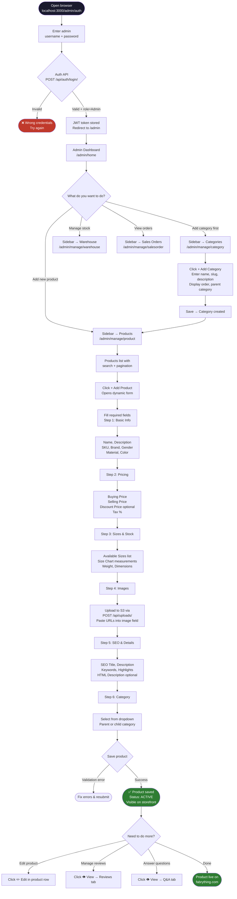

# Fabrything — Bangladesh Clothing Store

A full-stack **Cash-on-Delivery** e-commerce platform for a B2C clothing store targeting the Bangladeshi market. Built with Django REST Framework and React.

**Live domain:** fabrything.com

> ### ⚠️ Architecture updated (COD refactor)
> This project was restructured into a production-ready COD storefront. Key changes:
> - **Database is now PostgreSQL** (was MySQL).
> - **Payment is Cash on Delivery only** (bKash removed).
> - **Django apps were renamed** for clarity: `UserServices→accounts`, `ProductServices→catalog`,
>   `InventoryServices→inventory`, `OrderService→purchasing`, `StorefrontService→storefront`,
>   plus new `core` (store config/helpers) and `orders` (COD order layer) apps, and a `config` settings package.
> - **New sellable stock** lives on `catalog.ProductVariant` (per size/colour); checkout locks and
>   decrements it with `select_for_update()` inside `transaction.atomic` to prevent oversell.
> - **COD order state machine**: `PENDING_VERIFICATION → CONFIRMED → OUT_FOR_DELIVERY → DELIVERED`,
>   plus `CANCELED`/`RETURNED` (which auto-restock). Order numbers are now `ORD-XXXXXXXX`.
> - **Shipping** is a flat rate from `core.StoreConfiguration`, applied at order creation.
>
> **👉 Follow [`SETUP.md`](./SETUP.md) for setup** — because apps were renamed and the DB engine changed,
> you generate fresh migrations on first run. Some walkthrough diagrams below still show the pre-refactor
> flow (e.g. `SO-` codes, bKash) and are being updated.

---

## Table of Contents

- [Tech Stack](#tech-stack)
- [Project Structure](#project-structure)
- [Getting Started](#getting-started)
- [Customer Guide — How to Place an Order](#customer-guide--how-to-place-an-order)
- [Admin Guide — How to Add Products](#admin-guide--how-to-add-products)
- [API Reference](#api-reference)

---

## Tech Stack

| Layer | Technology |
|---|---|
| Backend | Django 5.0 + Django REST Framework 3.15 |
| Database | PostgreSQL (via psycopg 3) |
| Auth | JWT (SimpleJWT) — separate tokens for admin vs. customer |
| Frontend | React 18, MUI v5, Redux Toolkit, React Router v6 |
| UI Components | Swiper (carousel), Framer Motion (animations), Recharts |
| File Storage | AWS S3 (via boto3) |
| Server | Gunicorn + ASGI (asgiref) |

---

## Project Structure

```
fabrything/
├── backend/
│   └── EcommerceInventory/
│       ├── config/                 # settings (base/dev/prod), urls, wsgi, asgi
│       ├── core/                   # StoreConfiguration, shared helpers, middleware, permissions
│       ├── accounts/               # Admin & customer auth, roles, permissions, addresses
│       ├── catalog/                # Products, Categories, ProductVariant, reviews, Q&A
│       │   └── management/commands/{seed_clothing_data,seed_demo}.py
│       ├── inventory/              # Warehouses, racks, batch stock (back-office)
│       ├── purchasing/             # Purchase orders & sales orders (back-office)
│       ├── orders/                 # COD Order + OrderItem + state machine + checkout service
│       └── storefront/             # Public storefront API + customer cart + COD checkout
└── frontend/
    └── ecommerce_inventory/src/
        ├── pages/                  # Admin panel pages
        ├── storefront/             # Customer-facing storefront (pages + components)
        └── redux/                  # Cart state (variant-aware) + guest→user sync
```

---

## Getting Started

### Backend

```bash
cd backend/EcommerceInventory
python -m venv venv && source venv/bin/activate
pip install -r requirements.txt

# Copy and fill in environment variables
cp .env.example .env

python manage.py migrate
python manage.py seed_clothing_data --clear   # seed 50 products + categories
python manage.py runserver
```

### Frontend

```bash
cd frontend/ecommerce_inventory
cp .env.example .env
npm install
npm start
```

| URL | Purpose |
|---|---|
| `http://localhost:3000/` | Customer storefront |
| `http://localhost:3000/admin` | Admin panel |
| `http://localhost:8000/api/` | REST API |

---

## Customer Guide — How to Place an Order

### Full Order Flow

```mermaid
flowchart TD
    A([🏠 Visit Homepage\nfabrything.com]) --> B[Browse Hero Carousel\n& Featured Products]
    B --> C{Find a product?}
    C -- Browse categories --> D[/shop — Product Catalog/]
    C -- Flash sale / New arrivals --> E[Product Card on Homepage]
    D --> F[Click product card]
    E --> F

    F --> G[/product/:slug — Product Detail/]

    G --> G1[View photos ×3\nSelect size\nSet quantity]
    G1 --> G2[Click 'Add to Cart']
    G2 --> H[(Redux Cart State\nbrowser memory)]

    H --> I[/cart — Shopping Cart/]
    I --> I1{Logged in?}

    I1 -- Yes --> J[/checkout/]
    I1 -- No --> K[/auth/login\nwith redirect=/checkout/]
    K --> K1{New user?}
    K1 -- Yes --> K2[/auth/signup/\nCreate account]
    K1 -- No --> K3[Enter username + password]
    K2 --> J
    K3 --> J

    J --> J1[Select shipping address\nor add new one]
    J1 --> J2{Payment method}
    J2 -- Cash on Delivery --> J3[COD selected]
    J2 -- bKash --> J4[bKash selected]
    J3 --> J5[Click 'Place Order']
    J4 --> J5

    J5 --> L{API: POST\n/api/store/orders/}
    L -- Success --> M([✅ Order Confirmation\nOrder # SO-XXXXXXXX\nDelivery in 7 days])
    L -- Error --> N([❌ Show error message\nFix & retry])

    M --> M1{Payment was bKash?}
    M1 -- Yes --> M2[Send payment to\nbKash merchant number\nUse order # as reference]
    M1 -- No COD --> M3[Keep cash ready\nDelivery partner\nwill call]

    M --> O[/account/orders —\nTrack order status]

    style A fill:#1a1a2e,color:#fff
    style M fill:#2E7D32,color:#fff
    style N fill:#c0392b,color:#fff
    style L fill:#0f3460,color:#fff
```

---

### Step-by-Step Walkthrough

#### Step 1 — Discover Products

The homepage loads data from `GET /api/store/homepage/` and shows six product sections:

| Section | What it shows |
|---|---|
| Hero Carousel | Promotional banners with CTAs |
| Flash Sale | Biggest discounts (countdown timer) |
| New Arrivals | Latest 8 products |
| Trending | Most ordered in last 30 days |
| Best Sellers | Highest total quantity sold |
| On Sale | All discounted products |

Navigate to `/shop` to filter by category, gender, price range, color, material, or brand. Use the search bar for keyword search.

---

#### Step 2 — Product Detail Page

URL pattern: `/product/<slug>`

```
┌─────────────────────────────────────────────────────────┐
│  Home > Shop > Classic Cotton T-Shirt                   │
├───────────────────────┬─────────────────────────────────┤
│                       │  Fabrything                     │
│   [Main Image]        │  Classic Cotton T-Shirt         │
│                       │  ★★★★☆  4.2  (12 reviews)       │
│  [img1][img2][img3]   │                                 │
│   thumbnail strip     │  ৳499  ~~৳599~~  -17%          │
│                       │                                 │
│                       │  Cotton  |  Black  |  MEN       │
│                       │                                 │
│                       │  Select Size                    │
│                       │  [S] [M] [L] [XL] [XXL]        │
│                       │                     Size Chart  │
│                       │                                 │
│                       │  Quantity  [-] 1 [+]            │
│                       │                                 │
│                       │  [🛒 Add to Cart — ৳499]        │
│                       │                                 │
│                       │  Premium quality cotton…        │
└───────────────────────┴─────────────────────────────────┘
│  Specifications  │  Reviews (12)  │  Questions & Answers │
└─────────────────────────────────────────────────────────┘
│  You May Also Like                                      │
│  [card] [card] [card] [card]                            │
└─────────────────────────────────────────────────────────┘
```

> **Tip:** Click "Size Chart" to see measurements in inches for the selected product's category.

---

#### Step 3 — Shopping Cart

URL: `/cart`

The cart is stored in Redux (browser memory). Items persist across pages during a session.

```
┌─────────────────────────────────────────────────────┐
│  Shopping Cart  (2 items)                           │
├──────────────────────────────┬──────────────────────┤
│  [img] Classic Cotton T-Shirt│  Order Summary       │
│        Black · Size: M       │  ──────────────────  │
│        [-] 2 [+]  🗑          │  Subtotal    ৳998   │
│                    ৳998      │  Delivery    ৳60    │
│                              │  ──────────────────  │
│  [img] Polo T-Shirt Premium  │  Total       ৳1,058  │
│        Navy · Size: L        │                      │
│        [-] 1 [+]  🗑          │  [Proceed to        │
│                    ৳749      │   Checkout →]        │
└──────────────────────────────┴──────────────────────┘
```

> **Free delivery** on orders over ৳1,500. Otherwise a flat ৳60 delivery fee applies.

If you click **Proceed to Checkout** without being logged in, you are redirected to `/auth/login?redirect=/checkout` and returned automatically after logging in.

---

#### Step 4 — Account Creation / Login

URL: `/auth/signup` or `/auth/login`

**Sign up** requires:
- Username (unique)
- Email address
- Password

Country is pre-set to Bangladesh. Currency is BDT.

On success a JWT access + refresh token pair is issued and stored. The customer role is automatically set to `Customer`.

---

#### Step 5 — Checkout

URL: `/checkout` *(requires login)*

```
┌────────────────────────────────┬──────────────────────┐
│  1. Shipping Address           │  Order Summary       │
│  ──────────────────────────    │  ─────────────────   │
│  ● Home                        │  T-Shirt (M) ×2      │
│    12 Mirpur Road, Dhaka       │              ৳998    │
│    Dhaka - 1216                │  Polo (L) ×1         │
│                                │              ৳749    │
│  + Add New Address             │  ─────────────────   │
│                                │  Subtotal    ৳1,747  │
│  2. Payment Method             │  Delivery    Free ✓  │
│  ──────────────────────────    │  ─────────────────   │
│  ● Cash on Delivery            │  Total      ৳1,747   │
│    Pay when you receive        │                      │
│  ○ bKash                       │  [Place Order        │
│    Send to merchant number     │   ৳1,747 →]          │
│                                │                      │
│  3. Notes (optional)           │                      │
│  ──────────────────────────    │                      │
│  [Special instructions…]       │                      │
└────────────────────────────────┴──────────────────────┘
```

Clicking **Place Order** calls `POST /api/store/orders/` with:

```json
{
  "shipping_address_id": 3,
  "payment_method": "COD",
  "notes": "",
  "items": [
    { "product_id": 1, "quantity": 2, "size": "M" },
    { "product_id": 2, "quantity": 1, "size": "L" }
  ]
}
```

---

#### Step 6 — Order Confirmation

```
┌─────────────────────────────────────┐
│          ✅  Order Placed!           │
│                                     │
│  Your order has been placed.        │
│                                     │
│  Order Number   SO-A3F2C1B0         │
│  Total Amount   ৳1,747              │
│  Expected By    2026-04-19          │
│                                     │
│  ℹ️  Please keep ৳1,747 ready for   │
│     Cash on Delivery. Our delivery  │
│     partner will call you.          │
│                                     │
│  [View Orders]  [Continue Shopping] │
└─────────────────────────────────────┘
```

For **bKash** orders, the confirmation screen shows the merchant number and instructs the customer to use their order number as the payment reference.

---

#### Step 7 — Track Orders

URL: `/account/orders`

Customers can view all past orders, their status (`DRAFT → SENT → DELIVERED`), and individual item details.

---

## Admin Guide — How to Add Products

### Admin Access Flow



---

### Step-by-Step: Adding a Product

#### Step 1 — Log in to Admin Panel

Navigate to `http://localhost:3000/admin/auth` (or your production domain at `/admin/auth`).

Use your admin account credentials. Only users with `role = Admin` or `SuperAdmin` can access the panel.

---

#### Step 2 — Ensure the Category Exists

Before adding a product, confirm its category exists.

Go to **Sidebar → Categories** (`/admin/manage/category`).

```
┌──────────────────────────────────────────────────────────┐
│  Categories                                    [+ Add]   │
├───────────┬──────────────────┬───────────┬──────────────┤
│  Name     │  Slug            │  Parent   │  Actions      │
├───────────┼──────────────────┼───────────┼──────────────┤
│  Men      │  men             │  —        │  ✏️  🗑         │
│  T-Shirts │  men-tshirts     │  Men      │  ✏️  🗑         │
│  Women    │  women           │  —        │  ✏️  🗑         │
│  Saree    │  women-saree     │  Women    │  ✏️  🗑         │
└───────────┴──────────────────┴───────────┴──────────────┘
```

If the category does not exist, click **+ Add** and fill in:

| Field | Example |
|---|---|
| Name | T-Shirts |
| Slug | men-tshirts *(auto-generated from name)* |
| Description | Men's t-shirts and casual tops |
| Display Order | 1 *(lower = appears first)* |
| Parent Category | Men |

---

#### Step 3 — Open the Products Page

Go to **Sidebar → Products** (`/admin/manage/product`).

The products list supports:
- Full-text search (debounced 1 s)
- Column sorting
- Pagination (5 / 10 / 25 per page)
- Inline image preview
- Links to Reviews and Q&A for each product

Click the **+ Add** button to open the product form.

---

#### Step 4 — Fill in the Product Form

The form is divided into logical sections:

**Basic Information**

| Field | Required | Notes |
|---|---|---|
| Name | Yes | Becomes the URL slug automatically |
| SKU | Yes | Must be unique — e.g. `FAB-0042` |
| Description | Yes | Shown on product detail page |
| Brand | No | Displayed above product name |
| Gender | Yes | MEN / WOMEN / KIDS / UNISEX |
| Material | No | e.g. 100% Cotton |
| Color | No | e.g. Navy Blue |
| Status | Yes | ACTIVE (visible) / INACTIVE (hidden) |

**Pricing**

| Field | Required | Notes |
|---|---|---|
| Buying Price | Yes | Your cost price (internal only) |
| Selling Price | Yes | Listed price shown to customers |
| Discount Price | No | Leave blank if no discount |
| Tax % | No | Defaults to 0 |

> **How discounts work:** If Discount Price is set, customers see it as the actual price with the original Selling Price crossed out. The discount badge (`-17%`) is calculated automatically.

**Sizes & Physical Details**

| Field | Example |
|---|---|
| Available Sizes | `["S","M","L","XL","XXL"]` or `["FREE"]` for sarees |
| Size Chart | `{"S":{"chest":36,"length":27},"M":{"chest":38,"length":28}}` |
| Weight | 0.3 (kg) |
| Dimensions | 30x20x5 (cm) |
| UOM | PCS |

**Images**

Images are stored as a JSON list of URLs. To upload:

1. Go to any product edit form or use the upload endpoint directly
2. Upload images via `POST /api/uploads/` — returns an S3 URL
3. Paste the returned URL(s) into the `image` field as a JSON array

```json
[
  "https://your-bucket.s3.amazonaws.com/products/shirt-front.jpg",
  "https://your-bucket.s3.amazonaws.com/products/shirt-back.jpg",
  "https://your-bucket.s3.amazonaws.com/products/shirt-detail.jpg"
]
```

> **Tip:** Add at least 3 images — the product detail page shows a thumbnail strip for multiple images, which significantly increases conversion.

**SEO Fields**

| Field | Notes |
|---|---|
| SEO Title | Defaults to `{name} - Fabrything` if blank |
| SEO Description | Max 160 characters |
| SEO Keywords | JSON list: `["cotton","men","casual"]` |

**Advanced**

| Field | Notes |
|---|---|
| Highlights | JSON list of bullet points shown on product page |
| HTML Description | Rich HTML shown below the main description |
| Specifications | JSON key-value pairs shown in the Specifications tab |
| Addition Details | Freeform JSON — set `{"flash_sale": true}` to feature in flash sale |

---

#### Step 5 — Save and Verify

After saving, the product is immediately live on the storefront (status `ACTIVE`).

**Verify it worked:**

1. Open `http://localhost:3000/shop` — the product should appear in the catalog
2. Click the product card — confirm the detail page loads with your images
3. Check the homepage — if `addition_details` has `flash_sale: true` and a discount price is set, it will appear in the Flash Sale section

---

### Admin Panel Layout

```
┌──────────────────────────────────────────────────────────────┐
│  Fabrything Admin                    [Profile]  [Logout]      │
├──────────────┬───────────────────────────────────────────────┤
│              │                                               │
│  Dashboard   │   Products                      [+ Add]       │
│              │   ──────────────────────────────────────────  │
│  Products    │   [Search…]                                   │
│              │                                               │
│  Categories  │   ID │ Name            │ Price │ Status │ Act │
│              │   ───┼─────────────────┼───────┼────────┼─── │
│  Warehouse   │   1  │ Classic T-Shirt │ ৳599  │ ACTIVE │ ✏️👁│
│              │   2  │ Polo Premium    │ ৳899  │ ACTIVE │ ✏️👁│
│  Users       │   3  │ Linen Shirt     │ ৳1599 │ ACTIVE │ ✏️👁│
│              │   ──────────────────────────────────────────  │
│  Purchase    │   ← 1  2  3 …  →                             │
│  Orders      │                                               │
│              │                                               │
│  Sales       │                                               │
│  Orders      │                                               │
│              │                                               │
└──────────────┴───────────────────────────────────────────────┘
```

---

### Managing Orders (Admin)

Sales orders arrive at **Sidebar → Sales Orders** (`/admin/manage/salesorder`).

Order lifecycle:

```
DRAFT  →  SENT  →  DELIVERED  →  COMPLETED
                ↘  PARTIAL DELIVERED
                ↘  CANCELLED
                ↘  RETURNED
```

To update an order status, open the order and select the new status. For cancellations, a reason field is required.

The storefront API also exposes admin endpoints at `/api/store/admin/` for dashboard stats and order management via external tools.

---

## API Reference

### Public Endpoints (no auth required)

| Method | URL | Description |
|---|---|---|
| GET | `/api/store/homepage/` | Homepage data — categories, products, flash sale |
| GET | `/api/store/categories/` | Full category tree |
| GET | `/api/store/products/` | Product list with filters |
| GET | `/api/store/products/<slug>/` | Single product detail |

**Product list query params:**

| Param | Example | Notes |
|---|---|---|
| `category` | `men-tshirts` | Filter by category slug |
| `gender` | `WOMEN` | MEN / WOMEN / KIDS / UNISEX |
| `price_min` | `500` | Minimum price (BDT) |
| `price_max` | `2000` | Maximum price (BDT) |
| `color` | `Black` | Partial match |
| `brand` | `Aarong` | Partial match |
| `search` | `cotton shirt` | Full-text search |
| `ordering` | `price_low` | `price_low` / `price_high` / `newest` / `name` |

---

### Customer Auth Endpoints

| Method | URL | Body |
|---|---|---|
| POST | `/api/store/auth/signup/` | `username, email, password, first_name, last_name, phone` |
| POST | `/api/store/auth/login/` | `username, password` |

Both return `{ access, refresh }` JWT tokens.

---

### Customer Account Endpoints *(JWT required)*

| Method | URL | Description |
|---|---|---|
| GET / PUT | `/api/store/profile/` | View or update profile |
| GET / POST | `/api/store/addresses/` | List or add shipping addresses |
| PUT / DELETE | `/api/store/addresses/<id>/` | Update or remove an address |
| POST | `/api/store/orders/` | Place an order |
| GET | `/api/store/orders/list/` | Customer's order history |
| GET | `/api/store/orders/<id>/` | Single order detail |
| POST | `/api/store/reviews/` | Submit a product review |
| POST | `/api/store/questions/` | Ask a product question |

---

### Seeding the Database

```bash
# Seed fresh (clears all existing products & categories)
python manage.py seed_clothing_data --clear

# Add products if database is empty (safe, no overwrites)
python manage.py seed_clothing_data

# Update images on existing products without recreating them
python manage.py seed_clothing_data --update-images
```

The seed creates **50 products** across **14 categories** (Men, Women, Kids + subcategories) with 3 images per product.
